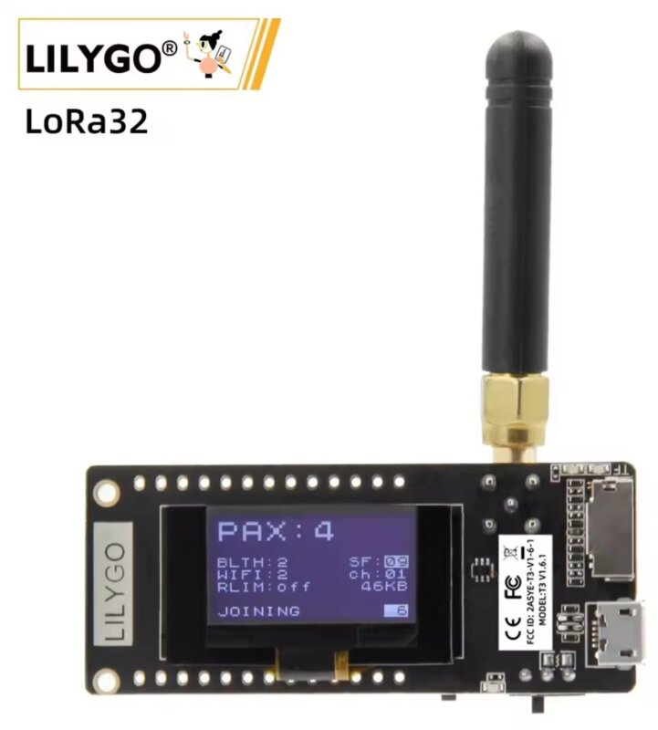
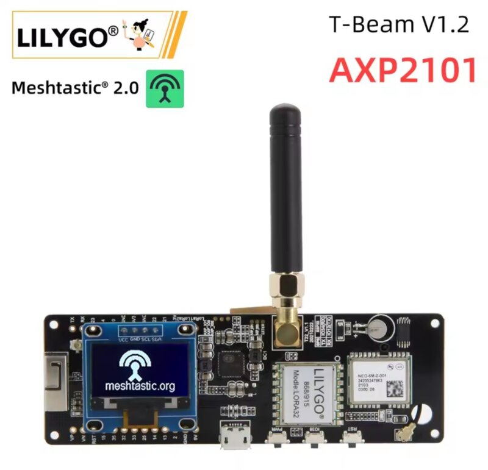
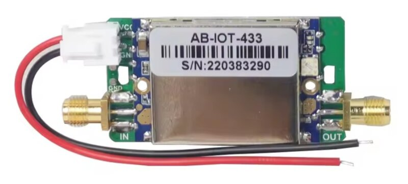

# PTT LoRa

**Voz por LoRa en una red inspirada de manera simplificada en Tetra.** Una placa LoRa
de unos 20-30 € y tu móvil o POC Android que hace de interface.Opcionalmente también envía tu posicion a aprs-fi.

**La cobertura crece añadiendo placas.** Cada celda que pones —la misma placa,
en alto— extiende la red, y se encadenan por radio o por internet (opcionalmente cuándo una celda no escucha otra) . El límite no
es la potencia, la red crece exponencialmente interconectandose entre si.

Está desarrollado para **radioaficionados con licencia**: funciona en la banda de 70 cm, sin cifrar, y cada estación
se identifica con su indicativo.

**Está funcionando, no es una idea.** Voz real entre móviles a través de la
radio, y **3,2 km sin visión directa con 50 mW y la antena de fábrica**, sin
perder un solo paquete en las pruebas.

---

# Empezar

**Dos pasos. Diez minutos.**

###  👉· La placa

Una **LilyGO LoRa32 v2.1** o una **T-Beam v1.2**, ojo, elige siempre la **versión de 433 MHz**
(ESP32 + SX1278).

| <a href="https://a.aliexpress.com/_ExGKbhC"></a> | <a href="https://a.aliexpress.com/_EI7hfvo"></a> |
|:--:|:--:|
| **LilyGO LoRa32 v2.1**<br>[AliExpress](https://a.aliexpress.com/_ExGKbhC) · [Amazon](https://amzn.eu/d/0i5hTx0X) | **LilyGO T-Beam v1.2**<br>[AliExpress](https://a.aliexpress.com/_EI7hfvo) · [Amazon](https://amzn.eu/d/01GfZDEd) |

*Fotos del fabricante, orientativas: en la tienda hay que elegir la variante de **433 MHz**.*

### 1 · Grábale el firmware

👉 **https://pyopower.github.io/pttLoRa/** — desde el navegador, sin instalar
nada. Conectas la placa por USB, pulsas el botón de tu modelo y listo.

> Hace falta **Chrome o Edge en un ordenador**: es el navegador quien habla con
> el puerto serie, y Firefox, Safari y los navegadores de móvil no lo hacen.
> ¿Prefieres a mano? [Binarios sueltos](https://github.com/pyopower/pttLoRa/releases/latest)
> y las órdenes de `esptool` más abajo.

### 2 · Instala la app en tu móvil

| descarga | para |
|---|---|
| **[pttlora.apk](https://pyopower.github.io/pttLoRa/pttlora.apk)** | **cualquier móvil** — 64 y 32 bits |
| [pttlora-v7a.apk](https://pyopower.github.io/pttLoRa/pttlora-v7a.apk) | sólo 32 bits, la mitad de tamaño, para móviles viejos |

Android 4.4 o posterior. Abre la app, entra en **Ajustes**, escribe **tu
indicativo** y elige el nodo — aparece por Bluetooth, o por WiFi si la placa
está en tu red. Y ya puedes hablar.

⚠️ Sin indicativo el nodo sale como `NOCALL` y no debe transmitir: **esto es
para radioaficionados con licencia**, en 70 cm y sin cifrar.

**No necesitas ningún servidor para el enlace opcional de células por internet.** Ya hay uno funcionando y la app apunta ahí de
fábrica si activas la opción; sólo hace falta el tuyo si quieres una red aparte.

---

*Lo que sigue es el porqué de todo: para qué sirve, cómo funciona y cómo está
hecho. No hace falta para usarlo.*

---

## El hardware, en detalle

**Una placa LoRa de 433 MHz y un móvil Android.** Nada más — ni cuota, ni
cobertura, ni servidor, ni internet.

⚠️ **La placa tiene que ser la versión de 433 MHz.** LilyGO vende las mismas
placas en 433, 868 y 915: la de 868/915 lleva un SX1276 que **no sintoniza**
esta banda y no sirve. Míralo antes de comprar, que es el error más caro y el
más fácil de cometer.

| placa | radio | lleva además | entorno |
|---|---|---|---|
| **LilyGO LoRa32 v2.1** (T3 v1.6.1) | ESP32 + SX1278 | pantalla OLED | `lora32` |
| **LilyGO T-Beam v1.2** | ESP32 + SX1278 | pantalla, **GPS**, portapilas 18650 | `tbeam` |

**Las dos hacen exactamente lo mismo y los tres papeles**: celda, nodo o suelta.
Es el mismo firmware y se elige desde la app, así que ninguna es "la de llevar"
ni "la de dejar puesta" — eso lo decides tú y lo puedes cambiar mañana.

**La LoRa32 es bastante más barata, y para la mayoría sobra.** Si vas a llevarla
con el móvil al lado, tu posición ya la pone el teléfono: el GPS de la placa no
te aporta nada. Empieza por ahí y ahórrate la diferencia.

**La T-Beam se gana el precio en dos casos concretos**, los dos con la placa
sola: cuando quieres que **sepa dónde está sin móvil** —una celda que se dibuja
en el mapa ella sola, o un rastreador— y cuando quieres **batería sin
inventártela**, que es lo que necesita una placa en un collado o en una mochila.

Y si la LoRa32 se te queda corta por ahí, no has perdido nada: una placa de más
en la red es una celda de más, que es justo lo que hace que crezca la
cobertura.

**El móvil**: cualquiera con **Android 4.4 o posterior**. Se conecta a la placa
por Bluetooth LE o por WiFi, y la app no necesita Play Services ni cuenta de
nada. Aviso por experiencia: **el Bluetooth LE va fino de Android 5 en
adelante**; en 4.4 da guerra, y ahí es mejor conectar por WiFi — la placa
levanta su propia red si se le pide.

**La antena importa más que la placa.** Las medidas de arriba son con una antena
micro SMA de las que vienen en la caja; con algo decente en alto, otra historia.

**Un empujoncito extra?? Las plaquitas LoRa funcionan de manera excelente solas pero en algun caso te puede interesar: Hay varios amplificadores LoRa en el mercado que pueden catapultar esos mW de las plaquitas a uno o unos pocos watios e incluso con previo en recepcion para compensar si tienes una tirada de cable de antena exterior larga.
Ejemplo de ampli barato con buenos resultados:

<a href="https://a.aliexpress.com/_Ew65GwK"></a>

[AB-IOT-433 en AliExpress](https://a.aliexpress.com/_Ew65GwK) — el que uso.

Cuidado al elegir otros tipos/modelos no todos sirven para LoRa y transmisiones digitales.

---

## Cómo funciona

```
    ZONA A                                  ZONA B
                  ┌──────────────┐
                  │  reflector   │   opcional, y ya hay uno
                  └──┬────────┬──┘   puesto: une por internet
        internet ────┘        └──── internet   zonas que no
             │                          │      se oyen
        ┌────┴────┐                ┌────┴────┐
        │  CELDA  │                │  CELDA  │  en alto, con
        └────┬────┘                └────┬────┘  antena, y REPITE
             │  radio LoRa               │
        ┌────┴────┐                      │
        │         │                      │
     ┌──┴───┐  ┌──┴───┐              ┌───┴──┐   no repiten: donde
     │ nodo │  │ nodo │              │ nodo │   hay celda no hace
     └──┬───┘  └──┬───┘              └───┬──┘   falta
    BLE │    WiFi │                      │
       📱        📱                     📱      hablas desde aquí
```

**Tres papeles, un solo firmware, y la placa elige sola:**

- **Celda** — la pones en alto, con corriente y buena antena. Repite todo lo que
  oye, y es la que convierte tres placas sueltas en una red que cubre un valle.
  Si tiene internet, además une tu zona con otras por un reflector.
- **Nodo** — la que llevas encima. Habla con tu móvil por Bluetooth o WiFi y se
  calla cuando hay una celda a la vista, para no estorbar.
- **Suelto** — sin ninguna celda cerca, dos placas en el campo **ya hacen red**
  ellas solas y se repiten la una a la otra. No hay nada que configurar.

```
  Sin infraestructura, sin cobertura y sin internet:

      📱── nodo ────RF────► nodo ──📱    aquí sí se repiten
```

---

## Para qué sirve

Hablar por voz donde no hay nada. Es un walkie de grupo que **no depende de
ninguna red** — y la cobertura no es la que te toque: es la que tú decidas
poner.

### La cobertura se compra por celdas, no por vatios

Aquí está la idea que lo cambia todo. Una celda **no es un repetidor caro**: es
la misma placa de 30 €, en alto, con corriente y una antena decente. Y la
cobertura de la red **es la suma de sus celdas**, así que crece añadiendo
placas, no subiendo potencia.

```
  una celda        dos celdas           cinco celdas
     ●                ●━━━━●         ●━━━●━━━●━━━●━━━●
  un valle      el valle de al lado    una comarca
```

Y no hay que elegir cómo se encadenan: **por radio** (una celda oye a la otra y
repite) o **por internet** (cada celda con red se engancha al mismo reflector y
dos zonas que no se oyen quedan unidas). Lo normal es mezclarlo.

Lo que eso ahorra frente a montar un repetidor de verdad: **sin duplexor, sin
cavidades, sin PA, sin torre, sin alquiler de emplazamiento y sin coordinación
de frecuencia**. Una celda entera cabe en una caja estanca con un panel solar.

Y escala de verdad, medido: **veinte nodos balizando cada minuto ocupan el
1,37 % del canal**. La red no se ahoga al crecer, porque los nodos que ven una
celda **se callan** en vez de repetir — es justo lo contrario de una malla, donde
cada nodo nuevo empeora la red.

**Por eso la comparación con un repetidor de FM no va por vatios.** Ese
repetidor, con toda su potencia, **no entra en el valle que tiene detrás**: la
sombra no se rompe con más vatios. Aquí la rompes poniendo otra placa de 30 € en
el sitio donde cae. Medido: a 3,2 km sin visión directa se oía **mejor** que a
1,75 km con visión. **No se planifica por radios, se planifica por sombras.**

### Casos concretos

- **Montaña, valles, pistas forestales.** Un grupo con móviles y una placa cada
  uno se oye a kilómetros sin repetidor de nadie.
- **Un pueblo o un valle entero** con una sola celda en un tejado.
- **Un club o una comarca**: cada socio pone una celda donde puede y la red
  crece sola, sin permisos ni infraestructura compartida que gestionar.
- **Emergencias y simulacros**: funciona con la infraestructura caída, y una
  placa con batería en un collado abre el paso a otro valle en cinco minutos.
- **Salir en el mapa**: la posición de cada uno viaja por la misma radio, y
  desde una celda con internet se publica en APRS-IS y se ve en aprs.fi.
- **Experimentar**: el protocolo cabe en una página y las herramientas son
  Python suelto. Se escucha la red entera con un script de treinta líneas.

Lo que **no** es: no da calidad de teléfono —es Codec2 a 1200 bps, se entiende
bien y suena a radio— y no es privado, porque va sin cifrar y a propósito.

## Uso legal

**Esto es para radioaficionados con licencia.** El perfil de fábrica —439,600
MHz, 250 kHz de ancho, 17 dBm, voz sin cifrar— está pensado para el servicio de
aficionados y para ningún otro.

- **Comprueba tu plan nacional antes de encender.** 430-440 MHz está atribuida
  al servicio de aficionados en las tres regiones de la UIT, pero **el reparto
  interno lo fija cada país** y no coincide. 439,600 con 250 kHz de ancho ocupa
  `439,475-439,725`: mira qué hay ahí en tu plan y en el de tus vecinos, porque
  un canal así se oye lejos. Nadie ha hecho ese trabajo por ti.
- **Tu indicativo no es opcional.** El nodo lo baliza y lo mete en la cabecera de
  cada transmisión: eso es la identificación de tu estación. Un nodo sin
  configurar sale como `NOCALL` y no debe transmitir así.
- **No hay cifrado, y es a propósito.** Ocultar el contenido está prohibido en el
  servicio de aficionados (RR 25.2A). Quien busque privacidad, éste no es el
  proyecto.

El firmware **se niega a salir de 430-440 MHz** (`BANDA_MIN`/`BANDA_MAX` en
`platformio.ini`): rechaza cualquier orden de radio fuera de banda y, si
encuentra guardada una frecuencia que no vale, vuelve al canal de fábrica al
arrancar. No pretende detener a nadie —es código abierto y cambiar dos líneas
son dos minutos— sino evitar lo único que iba a pasar de verdad: un dedo torpe
escribiendo 443 en vez de 439 y transmitiendo fuera de banda sin enterarse.
Quien tenga otra atribución cambia esas dos líneas, recompila, y con ello asume
lo que emite.

## Compilar a mano

Para tocar el código, o si no puedes usar el instalador del navegador.

### El firmware

Con **PlatformIO** (compila y flashea de una vez):

```bash
cd firmware
pio run -e lora32 -t upload        # o -e tbeam
```

O con **esptool**, usando los binarios ya compilados —los de `docs/firmware/`, o
los del [último *release*](https://github.com/pyopower/pttLoRa/releases/latest):

```bash
esptool --port /dev/ttyACM0 --baud 460800 write-flash -z \
  0x1000  docs/firmware/lora32/bootloader.bin \
  0x8000  docs/firmware/lora32/partitions.bin \
  0xe000  docs/firmware/lora32/boot_app0.bin \
  0x10000 docs/firmware/lora32/firmware.bin
```

⚠️ **`boot_app0.bin` en 0xe000 no es opcional.** Si te lo saltas, después de una
actualización por radio la placa arranca desde la otra ranura y parece que el
firmware nuevo no ha entrado.

### La app

**Antes de nada: no hace falta compilarla.** El APK está listo:

| descarga | para |
|---|---|
| **[pttlora.apk](https://pyopower.github.io/pttLoRa/pttlora.apk)** | **cualquier móvil** — 64 y 32 bits |
| [pttlora-v7a.apk](https://pyopower.github.io/pttLoRa/pttlora-v7a.apk) | sólo 32 bits, para móviles viejos |

Si aun así quieres compilarla, el códec no va en el repositorio y hay un paso
más:

```bash
cd app
./preparar.sh                   # clona y parchea Codec2
./gradlew assembleRelease   # el APK, en app/build/outputs/
```

### Si una placa no responde

`escaner/` averigua cómo está cableada una placa desconocida y si su chip de
radio está vivo: prueba los patillajes conocidos leyendo el registro de
identidad del SX127x (`0x42` devuelve `0x12` y sólo eso), barre el CS y el MISO,
y si nadie contesta mide los pines como lo que son —entradas con pull-up y con
pull-down— para distinguir un bus al aire de un chip sin alimentación.

```bash
cd escaner && pio run -t upload --upload-port /dev/ttyACM0
```

**Compara siempre con una placa que funcione.** En una sana el bus queda suelto
y el MISO en alto; con el chip de radio sin alimentación, *todas* las líneas
caen a masa por sus diodos de protección. Eso distingue una avería de un
patillaje equivocado, y no se puede deducir desde el software.

### En el banco de pruebas

Un consejo para la primera prueba: **baja la potencia a 2 dBm** si tienes dos
placas en la misma mesa. A 17 dBm y veinte centímetros se satura el receptor de
la de al lado y ves tramas corruptas sin motivo aparente.

```bash
tools/nodo.py radio 439.600 --potencia 2
```

### El papel de cada placa

**Un solo firmware hace los tres papeles**, y se eligen desde la app sin
reflashear: obligar a elegir binario es pedirle al usuario un conocimiento que
no tiene por qué tener.

| Perfil | Qué hace |
|---|---|
| **Automático** (por defecto) | Puente para tu móvil, y repetidor sólo cuando hace falta: se calla si ve una celda o si no hay a quién repetir |
| **Repetidor fijo** (celda) | Repite siempre. Es el de la placa que se pone en alto: puede haber estaciones que le oigan a él y no entre ellas |
| **Sólo mi radio** | No repite nunca. Para quien no quiera gastar batería ni aire en los demás |

## El servidor: ya hay uno puesto

**Para hablar por radio no hace falta ningún servidor.** Dos placas y dos
móviles ya son una red, y una celda en un tejado cubre un valle sin que nada de
esto exista. El servidor entra sólo para tres cosas: **unir zonas que no se oyen
por radio**, **hablar desde el móvil sin placa** y **salir en el mapa de APRS**.

**Y para esas tres ya hay uno funcionando: `or.adan.ovh`.** La app y las
herramientas vienen apuntando ahí de fábrica, así que **no tienes que instalar
ni configurar nada** — enciendes y funciona.

Montar el tuyo sólo hace falta si quieres **tu propia red**, separada de la
pública, o si prefieres no depender de una máquina ajena. Y se puede hacer pieza
a pieza: cada una es independiente, así que puedes tener tu reflector y seguir
usando el resto del servidor público, o al revés.

| pieza | puerto | qué hace | ¿montar el mío? |
|---|---|---|---|
| **reflector** | 4461 | Punto de reunión de las celdas: une por internet zonas que no se oyen por radio, y arbitra quién habla. | Sólo si quieres una red aparte. Usando el público, tu grupo comparte canal con quien esté. |
| **nodo de datos** | 4460 | Un nodo sin radio al que se conecta la app: permite hablar **desde el móvil sin placa**, y sirve de red de seguridad cuando la radio no llega. | Sólo si has montado tu propio reflector: va colgado de él. |
| **igate APRS** | — | Publica en APRS-IS las posiciones que ve en el reflector, y salen en aprs.fi. | **Éste sí conviene propio**: entra en APRS-IS con **tu** indicativo, y decides tú qué estaciones se publican. |
| **relevo de mando** | 4464 | Administrar y actualizar un nodo instalado en una red ajena, donde no puedes abrir puertos: es el nodo quien llama. | Sólo si tienes una celda en un sitio prestado. |
| **censo de la red** | — | Anota qué células hay, desde cuándo, dónde y **quién oye a quién y con cuánta señal**. Observador puro: si se cae, la radio ni se entera. | Opcional. Es lo que convierte una lista de nodos en un mapa de sombras. |

Ninguna necesita base de datos ni dependencias: son procesos Python sueltos que
arrancan con un `systemd` de diez líneas.

```bash
# reflector
tools/nodovirtual.py --escucha 4461
# nodo de datos (cuelga del reflector)
tools/nododatos.py --escucha 4460 --reflector 127.0.0.1:4461 --exige-indicativo
# igate a APRS-IS
tools/igate.py --conf igate.conf
# relevo de mando (el --secreto no es opcional si lo abres a internet)
tools/mandovirtual.py --nodos 4464 --operador 4471 --secreto ~/.pttlora-secreto --exige
# censo de la red (cuelga del reflector)
tools/registro.py --reflector 127.0.0.1:4461 --fichero registro.json
```

⚠️ **Lo que entra por el nodo de datos SALE POR LA ANTENA de una celda**, con
el indicativo que diga quien habla — y el de un cliente que no se identifica era
`ANON`. Por eso `--exige-indicativo`: **para transmitir** hace falta algo con
forma de indicativo (UIT, más sufijos `-1` a `-99` para varios cacharros, y
generoso con el nombre del operador, `/P` o un prefijo de otro país); **para
escuchar**, nada. La asimetría es el punto: oír no hace emitir a la antena de
nadie. No es autenticación —cualquiera puede teclear uno válido— pero la
estación que transmite tiene un titular, y eso es lo mínimo. Banco:
`tools/pruebaindicativo.py`.

⚠️ **El relevo de mando (4464) es el único de los cinco que tiene que estar
abierto a internet y que MANDA en un nodo entero**, así que lleva secreto
compartido. Sin él, cualquiera que encuentre el puerto ocupa una de las cuatro
ranuras —y cuatro conexiones calladas dejan tu celda sin forma de
administrarla—, o se sienta en la ranura haciéndose pasar por tu nodo y recibe
en claro la clave del WiFi la próxima vez que la teclees. Pasó de verdad: 124
conexiones de un EC2 en una noche.

Cómo funciona: el relevo manda un reto al azar y el nodo contesta
`HMAC-SHA256(secreto, reto)`. **El secreto no viaja nunca**, y cambia el reto en
cada conexión. El del nodo se compila desde `firmware/src/secreto.h`, que **no
está en este repositorio**: copia `secreto-ejemplo.h`, pon el tuyo y compila. Un
firmware sin ese fichero compila igual, dice `secreto=no` en su estado y
sencillamente no puede usar un relevo que exija secreto.

⚠️ **Y si publicas binarios tuyos, compílalos con los entornos `-publico`**
(`pio run -e lora32-publico`), que llevan `-DSIN_SECRETO`: un `.bin` compilado
con secreto lo regala a quien lo descargue, basta un `strings`. Para eso está
`tools/compruebasecreto.sh`. El banco `tools/pruebapuerta.py` comprueba las tres
situaciones (nodo bueno, escáner callado, y el despliegue a medias donde aún no
se exige).

Para apuntar a tu servidor: en la app, **Ajustes → Enlace con otros nodos** (y
**Camino de datos** para el 4460); desde la consola, `tools/nodo.py enlace
mi-servidor.example 4461`.

⚠️ **El enlace va en la CELDA, no en un nodo cliente** — si no, lo que entra por
internet nunca sale por la antena. Está explicado y medido más abajo.

## Herramientas

```bash
tools/nodo.py estado
tools/nodo.py config EA1ABC --canal 1 --saltos 3 --potencia 2
tools/nodo.py escuchar 30
tools/nodo.py hablar grabacion.wav --modo 1200

# actualizar el firmware por el enlace, sin clave de WiFi
tools/ota_bt.py fw.bin --tcp 192.168.1.50

# banco de pruebas
tools/prueba2nodos.py --segundos 4          # dos nodos por cable
tools/pruebawifi.py 192.168.4.1      # varios usuarios a la vez
tools/pruebaenlace.py --a 192.168.4.1 --b /dev/ttyACM1
tools/vigila.py /dev/ttyACM1         # el código, por cable
bench/bench.py voz.wav               # modos de Codec2
```

⚠️ **`ota_bt.py` no necesita la clave del WiFi.** Va por el propio enlace KISS
del puerto 4460, así que sirve igual por cable, por BLE, por WiFi o por un canal
de mando saliente. La OTA de Arduino del 3232 sí la pide, y ésa es la diferencia
que hace que se pueda actualizar un nodo instalado en una red ajena.

---

## Cómo está hecho por dentro

A partir de aquí es detalle técnico: sirve para modificarlo o para escribir
otro cliente, y no hace falta para usarlo.

## Perfil de canal

| Parámetro | Valor |
|---|---|
| Frecuencia | 439.600 MHz |
| Ancho de banda | 250 kHz |
| Spreading factor | 7 |
| Coding rate | 4/5 |
| Sync word | 0x3B |
| Códec | Codec2, modo en la trama (por defecto 1200 bps) |
| Lote | 480 ms de audio por paquete |

**El alcance no se compra con SF.** A SF9/125 kHz no cabe ni Codec2 700C con
saltos (218 % del canal). Para voz hay que quedarse en SF7 y comprar alcance con
potencia y antena.

El canal ocupa **439,475-439,725 MHz**, y está fuera de la banda ISM, así que
no se comparte sitio con mandos de garaje ni estaciones meteorológicas. Se
cambia en `platformio.ini` o en caliente desde la app.

## Elección de códec

Medido con lotes de 480 ms a SF7/250 kHz, contando la ocupación del canal con el
emisor y con dos repetidores más:

| Modo | 1 emisor | con 3 saltos |
|---|---|---|
| Codec2 3200 | 34 % | 101 % ✗ |
| Codec2 1600 | 19 % | 58 % |
| **Codec2 1200** | 15 % | **46 %** ✓ |
| **Codec2 700C** | 11 % | **32 %** ✓ |
| Codec2 450 | 9 % | 26 % (bajo el mínimo usable) |

En LoRa la pérdida es de **paquete entero**: un lote perdido son 480 ms de
silencio, y eso destroza la inteligibilidad mucho más que el ruido de
cuantificación. Por eso **700C mandado dos veces intercalado se entiende mejor
que 1400 mandado una vez**, con el mismo gasto de aire. Gastar el ahorro en
redundancia, no en calidad de códec.

## Formato de trama

Cabecera de 8 bytes:

```
0  magic|version (0xA1)
1  canal
2  tipo (4 bits) | saltos restantes (4 bits)
3  src[0]  \
4  src[1]   > hash de 24 bits del indicativo
5  src[2]  /
6  stream   nuevo en cada pulsación de PTT
7  seq      número de lote dentro del stream
```

Tipos: `VOZ`, `INICIO`, `FIN`, `HOLA`. El **indicativo completo solo viaja en
INICIO y HOLA** — repetirlo en cada trama de voz serían 12 % de sobre veinte
veces por segundo. La identificación de estación queda cubierta: cada pulsación
de PTT abre con INICIO y hay baliza cada 10 minutos.

Dedupe de la malla: `(src, stream, seq, tipo)`, 64 entradas, 30 s.

## Protocolo con el anfitrión (móvil o gateway)

Tramas **KISS** por USB serie y por **Bluetooth SPP** a la vez. Se eligió SPP y no
BLE: el ESP32 normal es BLE 4.2 sin Coded PHY, así que BLE no da más alcance;
SPP es un flujo de bytes y el código KISS vale tal cual; y en Android es un
socket simple, igual de 4.4 a 15.

Órdenes: `INICIO` (abre stream), `VOZ` (lote), `FIN`, `CONFIG`, `ESTADO`,
`IDENT`, `RED`, `ENLACE`, `RADIO`.
Eventos: los mismos más `HOLA`, `CANAL` (ocupado/libre), `PTT` y `LOG`.

**El códec no vive en la placa.** El nodo solo mueve bytes: el móvil codifica y
el gateway decodifica. Así se cambia de modo de Codec2 en el campo sin
reflashear, y dos estaciones con distinto ajuste se entienden porque el modo va
en la trama.

## Varios usuarios en un mismo nodo (WiFi)

El nodo puede levantar **su propio punto de acceso**: el caso de la excursión, en
el que va en la mochila y el grupo se cuelga de él sin router, sin Internet y sin
infraestructura de ninguna clase. Hasta **8 sesiones** a la vez, que es lo que
admite el AP del ESP32.

```bash
tools/nodo.py red ap PTTLoRa-EA1ABC <clave>   # y reiniciar
tools/nodo.py --tcp 192.168.4.1 --ident EA1XYZ hablar voz.wav
```

Tres reglas, y las tres importan:

- **Cada usuario emite con SU indicativo** (`IDENT`). En banda de aficionado cada
  estación se identifica; un nodo que sacara a cinco personas bajo un solo
  indicativo no sería legal. Quien no lo declare usa el del nodo.
- **Habla uno solo.** El canal es simplex y la radio, una. Al segundo que pulse
  se le contesta con `PTT` quién tiene el micrófono, para que la app pueda decir
  "habla EA3XYZ" en vez de dejar un PTT que no responde. Se suelta al soltar,
  por TOT de 3 minutos, a los 5 s sin voz o al cerrarse la conexión.
- **Los clientes de un mismo nodo se oyen entre ellos.** Por radio no podrían: el
  nodo no escucha sus propias emisiones. Así que la voz del que habla se les
  devuelve por dentro, con `rssi = 127`, un valor imposible por LoRa (allí
  siempre es negativo). Es el mismo evento de voz por los dos caminos, así que la
  app no necesita saber de esto.

La puerta de entrada: en modo AP **la clave WPA2 ya es la puerta** (y por eso se
exige, de 8 caracteres o más: un AP abierto sería dejar el mando del nodo a quien
pase por la calle). Colgado de una red ajena se pide el código de 6 cifras que
sale en la pantalla, igual que por Bluetooth.

El Bluetooth se queda en un usuario: el `BluetoothSerial` de Arduino es
monousuario por diseño. El multiusuario natural es WiFi.

## Unir dos zonas por Internet (enlace)

Dos nodos que no se oyen por radio pueden enlazarse por red, y entonces cada uno
retransmite por su antena lo que oye el otro.

```bash
tools/nodo.py enlace 203.0.113.7 4461   # el otro escucha ahí
```

Por el enlace **no viajan órdenes, viajan tramas del aire tal cual**. El nodo del
otro lado las mete por su camino de recepción como si las hubiera oído por la
antena, y hereda gratis el descarte de duplicados, la entrega a sus clientes y la
repetición. Los bucles los corta ese mismo descarte: lo que vuelve rebotado ya
está apuntado.

Por eso el enlace tiene **su propio puerto** (4461, frente a 4460 de los
clientes): son dos protocolos distintos y distinguirlos por el contenido sería
adivinar.

### El enlace va en la CELDA, no en un nodo cliente

Medido el 8-sep-2026 y no es evidente: un nodo en `PERFIL_AUTO` **con una celda a
la vista no repite** —es lo que decide `hay_a_quien_repetir()`, y es lo que hace
que la red no se ahogue— así que lo que le entre por el enlace llega a *sus*
clientes y **nunca sale por la antena**. Con el enlace puesto en el nodo de casa,
28 lotes inyectados desde Internet llegaron a los clientes de ese nodo y los
contadores de la celda no se movieron: +2 en tres minutos, sus propias balizas.

Con el mismo enlace movido a la celda (`PERFIL_FIJO`, repite siempre), esos
mismos 28 lotes salieron al aire y otro nodo los oyó **a −69 dBm, cero
perdidos**.

O sea: **la pasarela entre Internet y la radio es infraestructura**, igual que en
TETRA. Va en la celda. Un nodo cliente con enlace no es una pasarela, es un
callejón sin salida — y uno silencioso, porque desde la app se ve entrar la voz
igual de bien.

### Redes de varias ubicaciones: el punto de reunión

Enlazar nodos entre sí funciona, pero obliga a que alguien tenga IP pública o
abra un puerto en su router, y cada nodo solo tiene cuatro ranuras. Con un punto
de reunión en un servidor se cae todo eso: **todos los nodos salen, ninguno
entra**.

```bash
tools/nodovirtual.py --escucha 4461   # en un servidor
tools/nodo.py enlace mi-servidor.example 4461     # en cada nodo
```

`nodovirtual.py` es un nodo sin radio: reparte a todos menos al que lo trajo,
exactamente igual que un nodo con varios enlaces, y **arbitra**. Esto último es
lo que un nodo no puede hacer solo: cada nodo bloquea el PTT cuando oye el canal
ocupado, pero eso solo tapa las colisiones que le da tiempo a ver, y dos
personas en ubicaciones distintas que pulsan a la vez no se enteran la una de la
otra hasta que la voz ha cruzado. El punto de reunión sí las ve a las dos, así
que **se queda con la primera y descarta lo que le pise** hasta que termine. No
arregla el retardo — dos que pulsen dentro de un tiempo de ida se seguirán
pisando, como en cualquier repetidor — pero convierte dos transmisiones
entrelazadas e ininteligibles en una que se entiende.

Las balizas nunca se arbitran: son identificación de estación, y callarlas sería
justo lo contrario de lo que hay que hacer.

Se pueden configurar **dos destinos**, y el segundo es **respaldo, no un segundo
camino**: el nodo usa el primero mientras responda y suelta el respaldo en
cuanto el principal vuelve. Estar en los dos a la vez duplicaría el tráfico y,
peor, cada punto de reunión arbitraría por su cuenta y podrían dejar pasar
transmisiones distintas.

## Actualizar por radio (OTA)

Opcional, y **solo si le pones WiFi al nodo** — que también es opcional. Sirve
para actualizar un nodo instalado en un sitio al que no puedes subir.

```bash
espota.py -i <ip> -p 3232 -a <clave wifi> -f firmware.bin
```

La IP sale en el estado del nodo (`wifi=…`). La clave de actualización **es la
del WiFi**, y sin ella la OTA no se levanta: en un proyecto público una clave
por defecto no es una clave.

Dos avisos: el ESP32 solo ve redes de **2,4 GHz**, y una actualización dura más
que el watchdog, así que el firmware se sale de él mientras dura — si no, la
placa se reiniciaría a medio flashear.

## Trampas y cicatrices

Todo lo que costó tiempo —y por qué— está en **[TRAMPAS.md](TRAMPAS.md)**: el
jitter que ponía a los nodos a balizar en bucle, el `src` que no podía salir del
indicativo, por qué una OTA parece no entrar, la baliza que mentía sobre su
propio papel... Diecisiete cicatrices con su explicación. No hace falta para
usar esto; hace falta si vas a tocarlo.

## Trabajo relacionado

- **`sh123/esp32_loradv`** (GPL-2.0) — lo más cercano que funciona: voz por LoRa
  en ESP32 con Codec2 y Opus, I2S en la placa. No tiene malla ni app. Complementario.
- **`goedzo/lilygo-t-echo-push-to-talk-lora`** (MIT) — modo PTT stub, pero buenas
  colas TX/RX y puente BLE con app.
- **QMesh** — malla inundada sincronizada con FEC Reed-Solomon+Viterbi (93 % → 99 %
  de paquetes recibidos) y códigos Walsh-Hadamard contra colisiones.
- **Meshtastic** tiene módulo de audio con Codec2 pero **solo en 2,4 GHz**: dicen
  que sub-GHz no da para audio continuo *en su malla completa*. Aquí el canal es
  dedicado, que es otra cosa.

---

## Licencia

**Apache 2.0** (ver `LICENSE` y `NOTICE`).

El códec es **[Codec2](https://github.com/drowe67/codec2)** de David Rowe,
**LGPL 2.1**. No va en este repositorio: `app/preparar.sh` lo clona de su
repositorio oficial y lo parchea para cruzarlo con el NDK.

⚠️ **La app lo enlaza estáticamente**, así que el APK que se distribuya queda
sujeto a la LGPL 2.1. Se cumple publicando el código fuente completo de la app
—que es lo que hace este repositorio— y conservando el `NOTICE`. El firmware del
nodo **no** contiene Codec2, y eso no es casualidad: el códec vive en los
extremos y la placa sólo mueve bytes. Las herramientas de `tools/` y `bench/`
llaman a `c2enc`/`c2dec` como programas externos, que no es enlazado.

## Avisos

- Esto **no es un producto**. Es un proyecto de radioaficionado y se publica por
  si le sirve a alguien, sin ninguna garantía.
- **El plan de banda es tuyo, no mío.** Lee la sección de uso legal antes de
  encender nada: 430-440 MHz está atribuida al servicio de aficionados en las
  tres regiones de la UIT, pero el reparto interno, la potencia y los usos los
  fija el plan nacional de cada país y no coinciden.
- El canal va **sin cifrar y a propósito**, porque en el servicio de aficionados
  no procede. Cualquiera con un receptor puede oírlo, y la posición que se
  publique viaja igual de clara.
